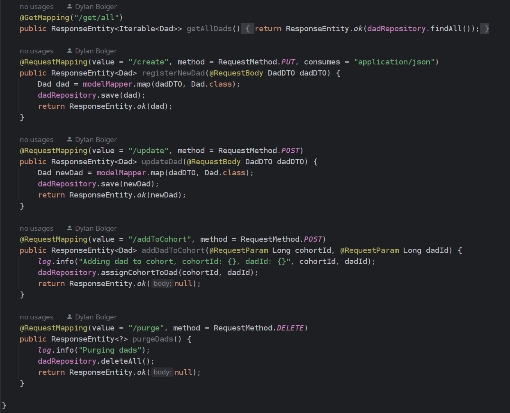

# Bad Dads
Dylan Bolger

Both the frontend and backend components have some foundation but are not complete.
Authentication on the backend using JWT Token is incomplete but has a start.
Backend data storage is beginning to persist but has some bugs needing worked out.
Frontend needs designed, but RESTful APIs should make hooking up the data simple once all endpoint are laid out.

## Screenshots

## Architecture Overview
Backend (for Admin and Client Data) - Spring Boot RESTful Service, PostgreSQL persistent data storage

Client (Admin) - Vue.js
Client (Companion App) - Native iOS application, written in Swift. 

## Backend

Build and deploy:
`sh bd.sh`

To build the Docker image:
`docker build -t baddads/admin .`

To run the docker image, bound to port 8080:
`docker run -p 8080:8080 baddads/admin`

## Frontend

Build dependencies:
`npm install`

Run development server:
`npm run dev`